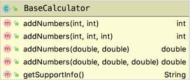

# Module 2 Lab

## Interfaces

### Defining Default methods

**Steps:**
1. _____ Create an **interface** called ``BasicCalculator``
1. _____ Create a **class** called ``TiCalculator`` that implements ``BasicCalculator``
1. _____ Create a **class** called ``HpCalculator`` that implements ``BasicCalculator``
1. _____ In ``BasicCalculator``, create a *default* method ``void printModel ()`` that uses System.out to print "Basic Calculator"
1. _____ Create a new class called ``App``
1. _____ Add a **main** method so you can run the app
1. _____ In the main method, instantiate a TiCalculator and a HpCalculator
1. _____ Call the ``printModel()`` method on each instance.  
1. Run App to answer the questions below

**Questions:**
* What did the TI Calculator print? _____________
* What did the HP Calculator print? _____________

### Implementing Default Methods

**Steps:**
1. _____ In ``TiCalculator``, create a method ``void printModel ()`` that uses System.out to print "Texas Instruments Calculator"
1. _____ Rerun App to answer the questions below

**Questions:**
* What did the TI Calculator print? _____________
* What did the HP Calculator print? _____________

### Implementing Interface Methods

**Steps:**
1. _____ Create an **interface** called ``ScientificCalculator``
1. Add the following method: ``public int square (int number)`` to ``ScientificCalculator`` 
1. _____ Have ``TiCalculator`` implement both ``BasicCalculator`` and ``ScientificCalculator``
1. _____ Implement the ``square`` method in TiCalculator having it ``return number * number``
1. _____ Add a statement in ``App`` that calls the ``square`` method in ``TiCalculator`` with a parameter of ``5`` and verify ``25`` is printed.

**Questions:**
* Can you call ``square()`` on the HpCalculator?
* If so, why so and, if not, why not?

## Inheritance

### Creating and Using a Superclass

**Steps:**
1. _____ Create a **class** called ``BaseCalculator``
1. _____ Add the following method: ``public int addNumers (int n1, int n2)`` having it  ``return n1 + n2`` 
1. _____ Have ``HpCalculator`` extend ``BaseCalculator``
1. _____ Have ``TiCalculator`` extend ``BaseCalculator``
1. _____ Update ``App`` to call ``addNumbers`` on ``HpCalculator`` verifying 1 + 1 = 2

**Questions:**
* Can you call ``addNumbers()`` on the TiCalculator?
* If so, why so and, if not, why not?

### Abstract Classes

**Steps:**
1. _____ Create an ``abstract`` method in ``BaseCalculator`` called ``getSupportInfo`` that takes no parameters and returns ``String``
1. _____ Change ``BaseCalculator`` to be ``abstract`` 
1. _____ Add the new method to ``HpCalculator`` and ``TiCalculator`` having them return "hp.com" and "ti.com" respectively

**Questions:**
* In ``App``, When you print out the return value from the call to ``getSupportInfo`` what is printed for ``TiCalculator``? _____________
* For ``HpCalculator``? _____________

## Overloading Methods

**Steps:**
1. _____ Add and implement the additional ``addNumbers`` shown in the class diagram above
1. _____ Using ``App`` verify each new method works correctly

**Questions:**
* How does the compiler know which one to invoke? _____________
* What happens if you try to add a method to ``BaseCalculator`` with a signature of ``public int addNumbers (int... ints)``? _____________
* Why does this happen?
